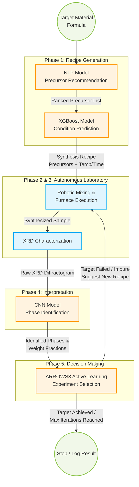

# assignment2
Assignment-Test

```mermaid
graph TD
    %% Define Styles
    classDef hardware fill:#e1f5fe,stroke:#03a9f4,stroke-width:2px;
    classDef ml fill:#fff3e0,stroke:#ff9800,stroke-width:2px;
    classDef data fill:#f1f8e9,stroke:#8bc34a,stroke-width:2px;

    %% Phase 1: Planning
    Start((Target Material<br>Formula)):::data --> NLP
    
    subgraph Phase 1: Recipe Generation
        NLP[NLP Model<br>Precursor Recommendation]:::ml
        XGB[XGBoost Model<br>Condition Prediction]:::ml
    end

    NLP -- Ranked Precursor List --> XGB
    XGB -- Synthesis Recipe<br>Precursors + Temp/Time --> Robot

    %% Phase 2 & 3: Physical Execution
    subgraph Phase 2 & 3: Autonomous Laboratory
        Robot[Robotic Mixing &<br>Furnace Execution]:::hardware
        XRD[XRD Characterization]:::hardware
    end

    Robot -- Synthesized Sample --> XRD
    XRD -- Raw XRD Diffractogram --> CNN

    %% Phase 4 & 5: Analysis and Active Learning
    subgraph Phase 4: Interpretation
        CNN[CNN Model<br>Phase Identification]:::ml
    end

    CNN -- Identified Phases &<br>Weight Fractions --> ARROWS3

    subgraph Phase 5: Decision Making
        ARROWS3[ARROWS3 Active Learning<br>Experiment Selection]:::ml
    end

    %% The Feedback Loop
    ARROWS3 -- "Target Failed / Impure<br>Suggest New Recipe" --> Robot
    ARROWS3 -- "Target Achieved /<br>Max Iterations Reached" --> End((Stop / Log Result)):::data
```
